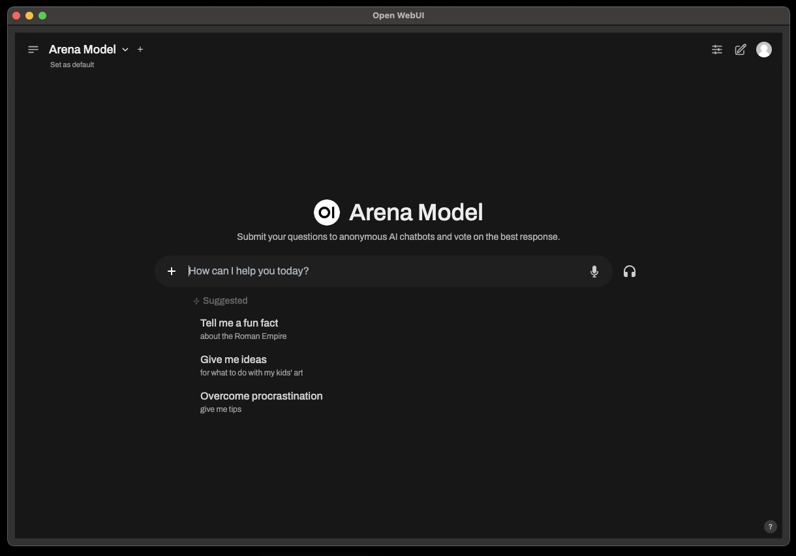

# Open-WebUI Integration with QT

A simple PySide6-based application to integrate with Open WebUI, manage server processes, and dynamically display web content.

---

## Features
- Runs as a standalone application with no external dependencies at runtime.
- Animated loader while waiting for the server to start.
- Automatic detection of server availability.
- Dynamic web content loading in a responsive GUI.